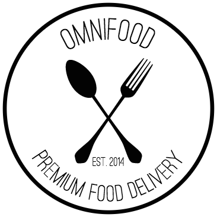

<h1 align="center">
     
    
     
    Omnifood
     
</h1>

<h4 align="center">Building <a href="https://majhirockzz.github.io/HTML5-and-CSS3-Project-1/" target="_blank">Omnifood</a>, your new premium food
    delivery service.</h4>

    
    
    
    

    <a href="#key-features">Key Features</a> •
    <a href="#how-to-use">How To Use</a> •
    <a href="#credits">Credits</a> •
    <a href="#license">License</a>

## Key Features

- Responsive Design
- Pure HTML/CSS
- Effect using jQuery

## How To Use

- `clone` the repository .
- Run `npm install` . 
- then, `gulp` .
- or open the `index.htm` in your favorite browser .
- or follow the above [link](https://majhirockzz.github.io/HTML5-and-CSS3-Project-1/) .

## Credits

- [Sumesh Majhi](https://github.com/MajhiRockzZ)

## License

[MIT](https://github.com/MajhiRockzZ/HTML5-and-CSS3-Project-1/blob/master/LICENSE)

